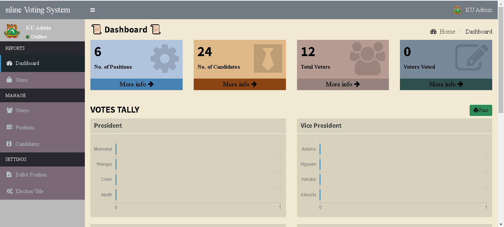
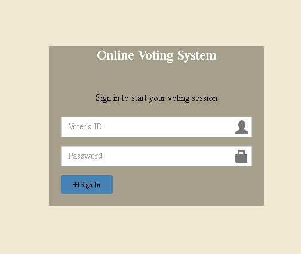
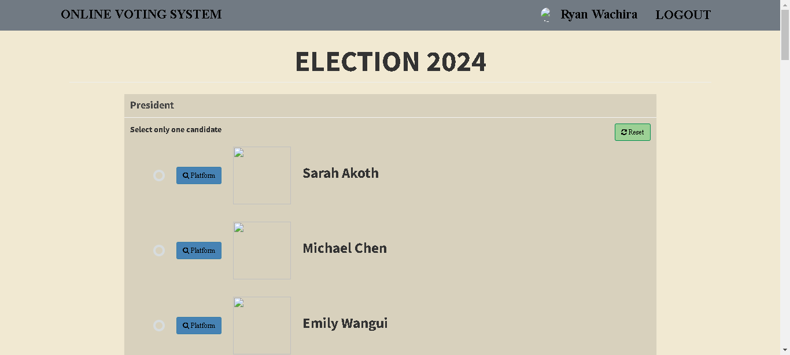

# Online Voting System

## Introduction

The **Online Voting System** is a web-based platform designed to facilitate secure, efficient, and accessible voting processes. It is particularly well-suited for private institutions, companies, or organizations that require an online voting solution for elections, decision-making processes, or surveys. With features tailored to meet the needs of entities such as universities, corporations, or private clubs, the system functions similarly to a SaaS (Software as a Service) offering.

### Example Use Case: Kenyatta University
At Kenyatta University, this system was implemented to streamline the voting process for student elections, ensuring that every student's voice was heard without the logistical challenges of physical polling stations. The system allowed the university administration to manage elections securely and efficiently.

## Project Objectives

- **Enhance Accessibility:** Allow eligible voters within the institution to cast their ballots from any location with an internet connection.
- **Ensure Security:** Protect the integrity of the voting process through robust encryption and authentication measures.
- **Improve Efficiency:** Simplify the voting process and reduce administrative overhead for the institution.
- **Facilitate Transparency:** Provide clear audit trails for each vote cast, ensuring accountability and transparency.
- **Promote Trust and Confidence:** Foster trust in the voting process by delivering a secure, transparent, and user-friendly platform.

## Key Features

- **Accessibility:** Voters can participate from any location with internet access, making the system ideal for remote or hybrid environments.
- **Security:** Advanced security measures, including encryption and multi-factor authentication, protect voter data and ensure the integrity of the voting process.
- **User-Friendly Interface:** Designed for simplicity and ease of use, even for users with minimal technical expertise.
- **Real-Time Monitoring:** Administrators can monitor voting activity in real-time, ensuring the process runs smoothly.
- **Customization Options:** The system can be tailored to suit the specific needs of different institutions, including custom ballot designs and election configurations.
- **Audit Trail:** Every vote is securely logged, providing a transparent and verifiable record of the election process.
- **Scalability:** The system can handle elections of varying sizes, from small clubs to large universities.

## Tech Stack

- **Frontend:** 
  - HTML5
  - CSS3
  - Javascript
  - Bootstrap

- **Backend:** 
  - PHP

- **Database:** 
  - MySQL

## Installation

1. **Clone the repository:**
   ```bash
   git clone https://github.com/yourusername/online-voting-system.git


2. **Navigate to the project directory:**
   ```
   cd online-voting-system
   ````

3. **Set up the database:**
- Import the provided SQL schema into your MySQL database.
- Update the database credentials in config.ini.

4. **Configure the web server:**
- Ensure your server supports PHP and MySQL.
- Point your server to the index.php file in the project root.

5. **Run the application:**
- Access the application via your browser at http://localhost/yourproject.

## Screenshots
The screenshots of the system are located in the Screenshots folder. Below are some examples showcasing different parts of the project:

# Admin Dashboard


# Voter Login Page


# Ballot Interface



## Features and Functionalities

# Admin User Experience
- **Login and Dashboard Management:** Admins can securely log in and manage voters, candidates, and positions.
- **Real-Time Monitoring:** Admins can track voter turnout and monitor vote counts dynamically.

# Voter User Experience
- **Secure Login:** Voters log in with unique credentials.
- **Simple Voting Process:** Voters can easily select candidates and submit their votes.
- **Vote Confirmation:** After submission, voters receive confirmation that their votes were recorded.

## Security Measures
- **Password Hashing:** Ensures that user passwords are securely stored.
- **Encryption:** Protects sensitive data transmitted between users and the server.
- **Authentication Mechanisms:** Verifies the identities of users before granting access to the system.

## Future Developments
- **Decentralized Voting:** Explore the integration of blockchain technology for a decentralized voting system.
- **Anonymization:** Implement voter ID anonymization for enhanced privacy and security.

